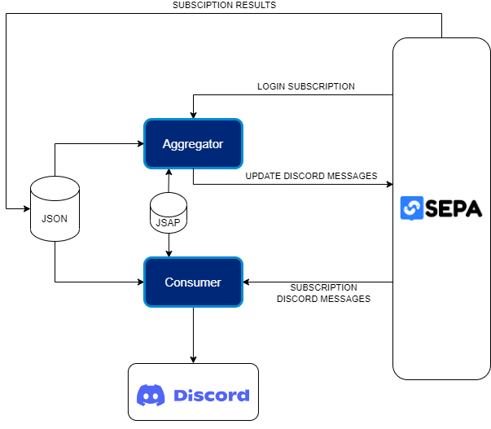

# Discord-bot-development`

## Intro
The bot has two type of components, a **consumer** and and some **aggregators**. Every aggregator subscribes to the graph of interest and formats any updated data before putting it back into the database, in the Discord message graph. The consumer subscribes to the Discord message graph and, whenever the aggregator updates a message, formats and sends it to Discord. The image above graphically shows an example of how the bot works.
## Configuration
First of all set your working directory to 'src'

<pre>
cd ./DiscordBot/src
</pre>

As shown in the image a JSAP file is used to configure the bot, but it is possible to do that also without using a JSAP. 
Bot can be configured in three ways.

- In the directory 'src' there is another one called 'resources'. In that directory there is a default JSAP file.
Open that file and configure the parametres: `host`, `sparql11protocol.port`, `saprql11seprotocol.availableProtocols.ws.port`, `extended.discordConfig.TOKEN` and `extended.discordConfig.CHANNEL_ID`.

- Set the same five parameters as enviroment variables on your shell. Set `HOST_NAME`, `HTTP_PORT`, `WS_PORT`, `CHANNEL_ID`, `TOKEN`.

- Specify a different JSAP path, different from the default one using line arguments.   <pre>python ./yourscript.py -jsap yourpath.jsap</pre>

If you don't know how to get your CHANNEL_ID and your TOKEN follow these steps:
#### CHANNEL_ID
- Just open your Discord server and right click on the insterested channel
- Click on 'copy channel ID'
#### TOKEN
To have your personal token you have to setup your bot on the Discord API.
- Visit on the website https://discord.com/developers/applications
- Click on 'new application'
- Give a name to your application and click on 'create'
- Click on 'OAuth2', 'URL generation' on the right panel
- Set 'bot' as scope and 'administrator' as bot permissions
- Copy the generated URL on a new page
- Add the bot to your server (now your bot is active and you should be able to see it in the server members)
- Go back to the previous page
- Click on 'Bot' on the right panel
- Your token is probably hidden, reset it to see it.
## Deployment
